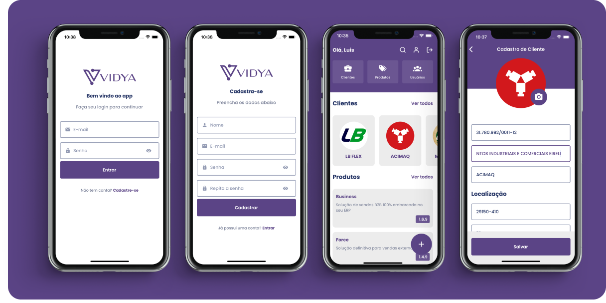
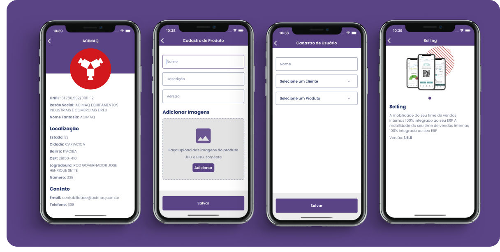

## About the Project

Vidya is an application developed to optimize the management of sales, products, and companies. Designed with a focus on usability and efficiency, the app offers an integrated solution that allows users to register companies, add products to their inventory, and record sales, all in a simple and organized manner. Through a clean and intuitive interface, Vidya makes monitoring the sales cycle an uncomplicated task, allowing managers and sales teams to focus on what really matters: growing their business.

In addition to basic functionalities, Vidya is equipped with tools that provide valuable insights into sales performance, facilitating strategic decision-making based on data. Whether you are a small entrepreneur or part of a larger company, Vidya is the perfect tool to simplify your sales operations.

## Key Features

- **Company Registration**: Create and manage a directory of companies with all the necessary information for contact and identification.
- **Product Registration**: Add products to your catalog, including details such as name, description, price, and stock.
- **Sales Recording**: Document sales of products to companies, with features that allow easy tracking of each transaction.

## Demonstration and Screenshots

- Demonstration Video:
  

https://github.com/LuisPeixoto/vidya/assets/49557710/93a476a9-8731-4808-b113-4d73bb7510da


- Check out some screenshots of the app in operation:





## Technologies and Libraries Used

- **styled-components**: Used to style components in a modular and reusable way, improving the maintenance of CSS in the React Native project.
- **react-native-vector-icons**: Provides a vast collection of icons, enhancing the user interface with intuitive graphic elements.
- **axios**: A Promise-based HTTP client library for making requests. It is used to consume external APIs effectively.
- **react-navigation**: Facilitates navigation between screens within the app, offering a smooth and intuitive user experience.
- **react-hook-form**: Optimizes the data collection process from forms, improving performance and reducing unnecessary re-renders.
- **yup**: Used for schema validation, ensuring that the data entered by users meet specified requirements.
- **eslint**: A code analysis tool to identify problematic patterns found in JavaScript code.
- **prettier**: A code formatter that ensures consistency and cleanliness in the source code.
- **firestore**: A Firebase NoSQL database service for storing and synchronizing data in real-time, facilitating the persistence of app information.

These tools and libraries were carefully chosen to ensure that the development of Vidya was not only efficient but also sustainable in the long term.

## How to Use

### Installation

1. Clone the repository:
```bash
git clone https://github.com/LuisPeixoto/vidya.git
cd vidya
```

2. Install the dependencies:
```bash
yarn install
```

### Execution

- For Android:
```bash
yarn android
```

- For iOS:
```bash
cd ios && pod install
yarn ios
```

## Application Download

The latest version of the Vidya app can be downloaded through the following link: [vidya.apk](https://github.com/LuisPeixoto/vidya/releases/tag/vidya.apk)


