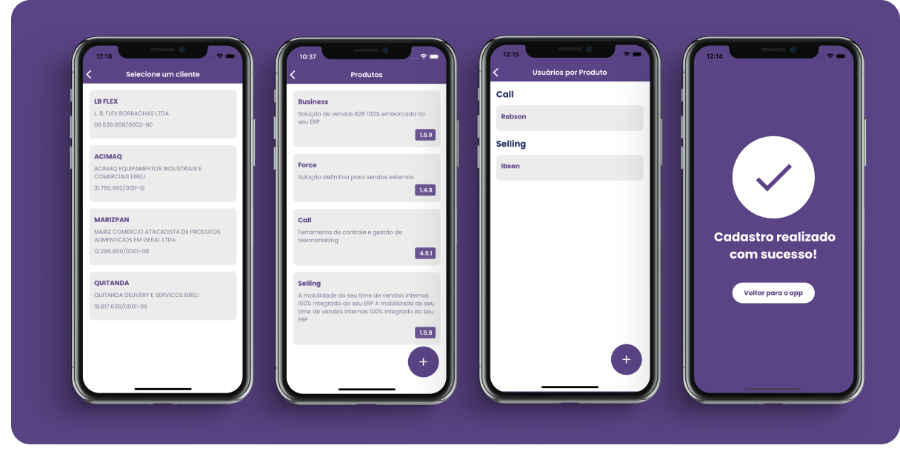

## Sobre

Vidya se trata de um aplicativo desenvolvido para o desafio técnico da Vidya code.

## Video da aplicação rodando

- https://drive.google.com/file/d/1FxEHGpI0_RwyQuB9Qv3CG8kLm92VO_WV/view?usp=sharing

## Screenshots




## Bibliotecas Utilizadas

Para o desenvolvimento do aplicativo foram utilizadas as seguintes bibliotecas:

- [styled-components](https://styled-components.com/e)
- [react-native-vector-icons](https://www.npmjs.com/package/react-native-vector-icons)
- [axios](https://axios-http.com/docs/intro)
- [react-navigation](https://reactnavigation.org/)
- [useform](https://useform.io/)
- [yup](https://www.npmjs.com/package/yup)
- [eslint](https://eslint.org/)
- [prettier](https://prettier.io/)
- [firestore](https://firebase.google.com/docs/firestore)

## APK do aplicativo

Link do apk do aplicativo: [vidya.apk](https://github.com/LuisPeixoto/vidya/releases/tag/vidya.apk)

## Instalação

### Clone do repositório

```bash
$ git clone https://github.com/LuisPeixoto/vidya.git
```

$ cd vidya

````

### Instalação das dependências

```bash
$ yarn install
````

### Execução

```bash
$ yarn android
```

ou

```bash
$ cd ios && pod install
$ yarn ios
```

```

```
